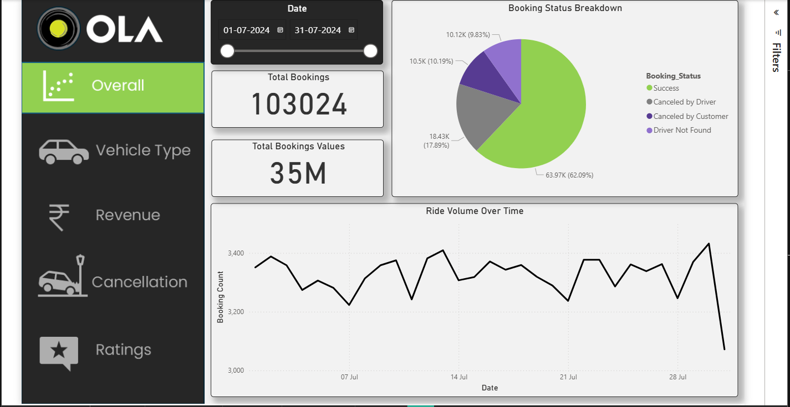
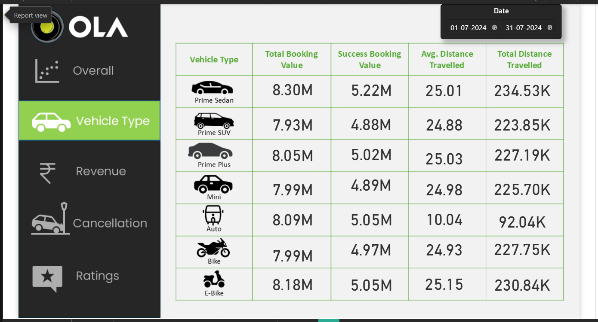
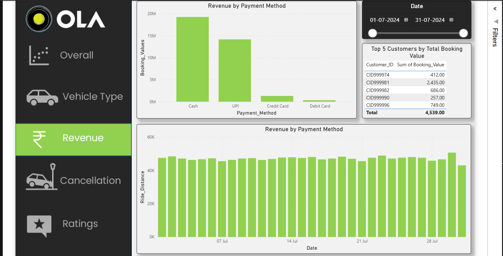
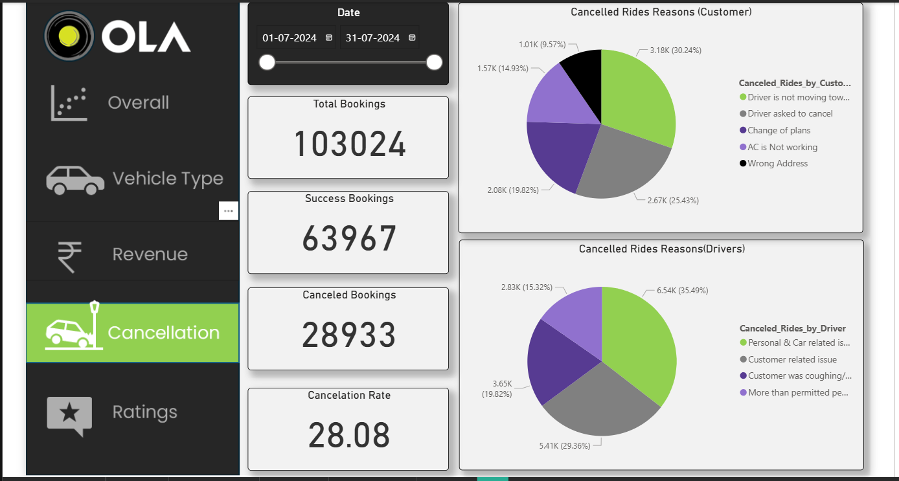
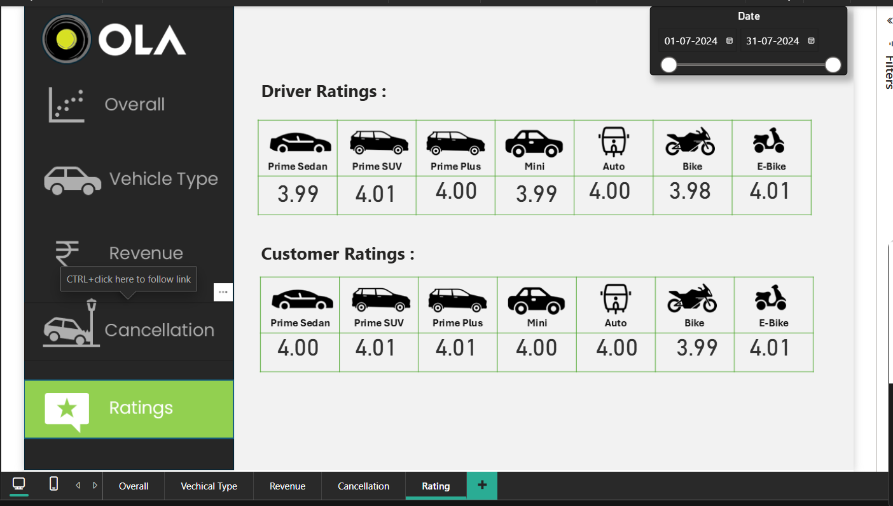
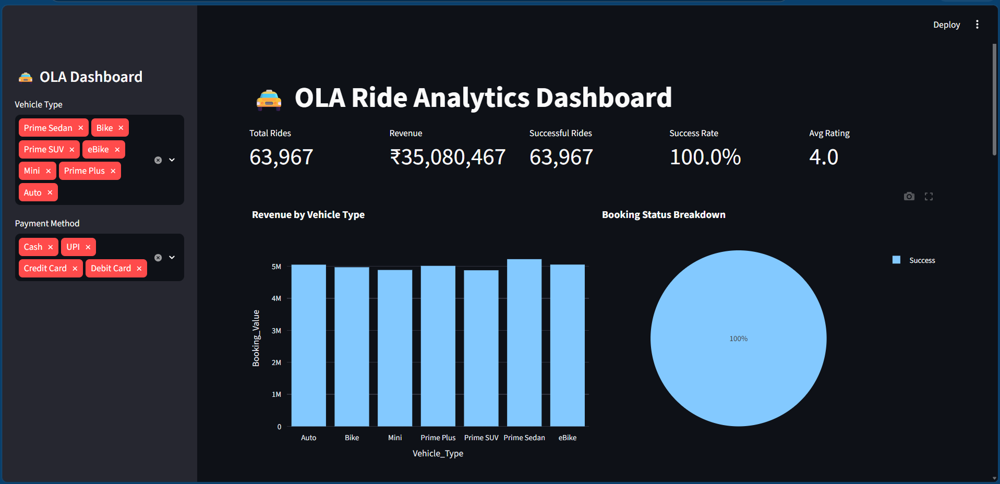

# OLA Ride Analytics Dashboard

## Project Overview

This project analyzes 103,024 ride-booking records from OLA to uncover insights related to revenue, ride success, cancellations, customer satisfaction, payment methods, and vehicle performance.

The project includes:

- Python Data Cleaning & Feature Engineering
- SQL Business Analysis
- Power BI Dashboard
- Streamlit Interactive Dashboard

---

## Tech Stack

- Python
- Pandas
- MySQL
- Power BI
- Streamlit
- Plotly

---

## Key Insights

- Peak Booking Hour: 12 PM
- Highest Revenue Vehicle Type: Prime Sedan
- Highest Rated Vehicle Type: Prime Plus
- Most Used Payment Method: Cash
- Success Rate: 62.1%

---

## Dashboard Pages

### Overall
- Total Rides
- Revenue
- Success Rate
- Ride Volume Trend

### Vehicle Analysis
- Booking Value by Vehicle Type
- Distance Analysis
- Success Booking Value

### Revenue Analysis
- Revenue by Payment Method
- Top Customers
- Revenue Trends

### Cancellation Analysis
- Customer Cancellation Reasons
- Driver Cancellation Reasons
- Cancellation Rate

### Ratings Analysis
- Driver Ratings by Vehicle Type
- Customer Ratings by Vehicle Type

---

## Project Structure

```text
data/
sql/
powerbi/
streamlit/
screenshots/
```

# Dashboard Screenshots

## Overall Dashboard



---

## Vehicle Type Analysis



---

## Revenue Analysis



---

## Cancellation Analysis



---

## Ratings Analysis



---

## Streamlit Dashboard




## Author

Gandharv Wankhade
